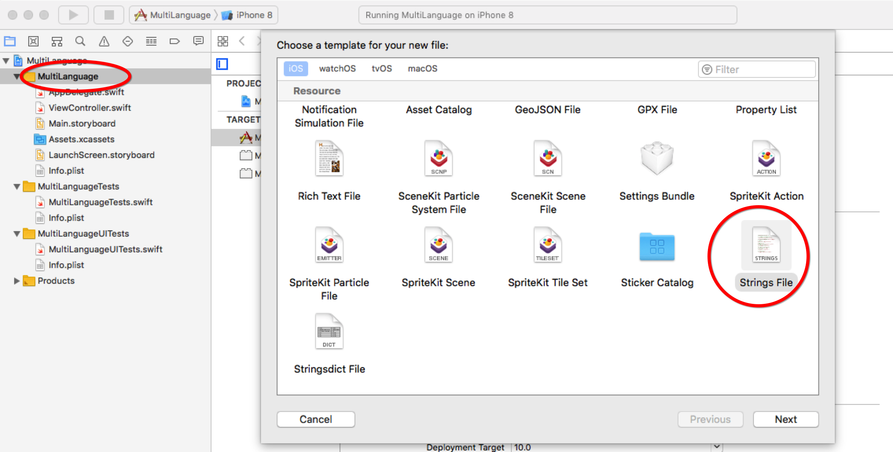
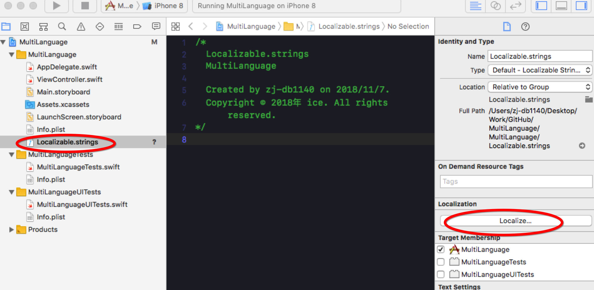
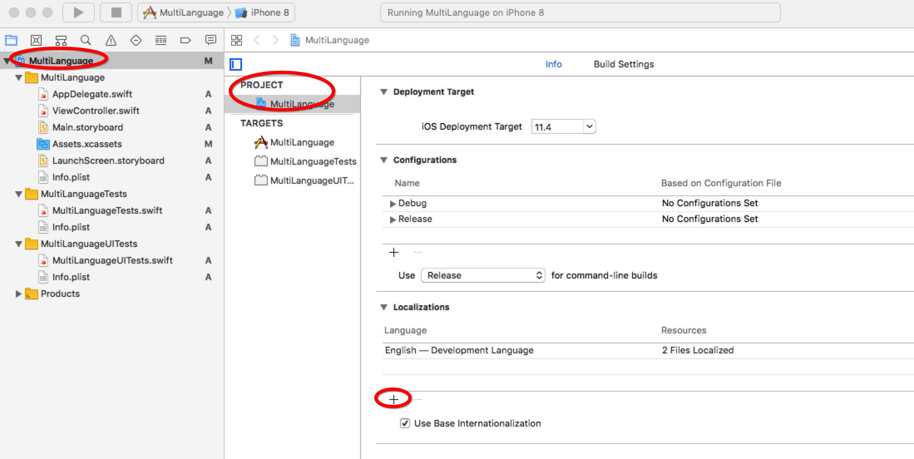
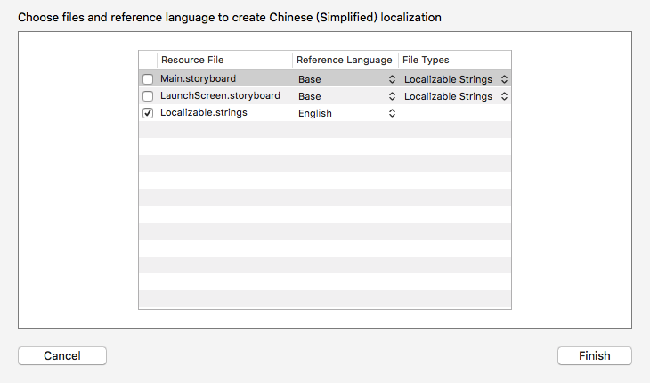
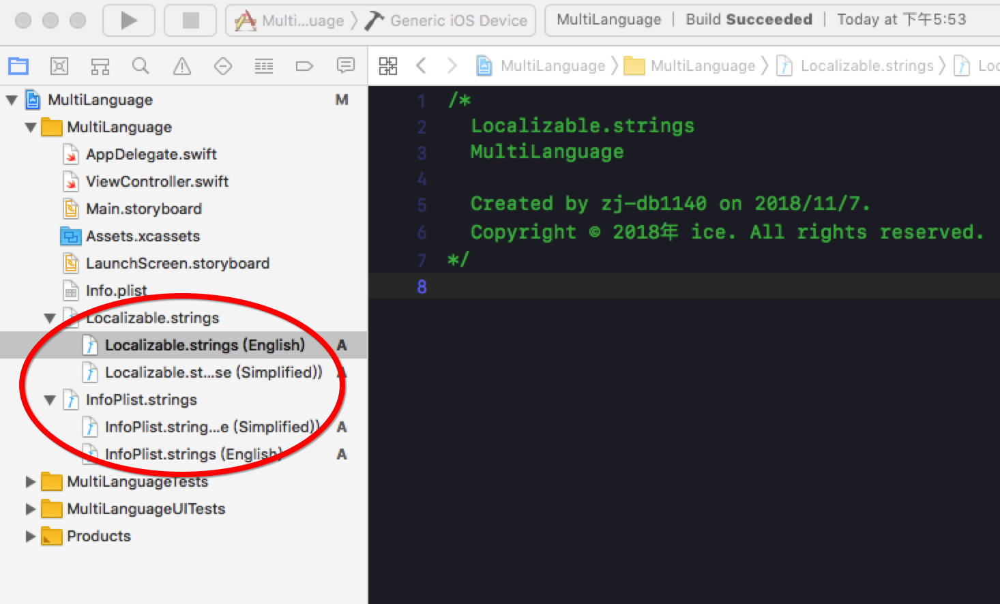

# 多语言适配及App内部语言切换
### 常规多语言适配

### 桌面名称多语言
1. 新建 InfoPlist.strings 文件一定需要这个文件名称

2. 初始化多语言文件 如果已经有多个语言的话这边可以选择是否支持，如果没有请继续下面操作

3. InfoPlist.strings 内容如下， 引号内为需要多语言的App名称

~~~
CFBundleDisplayName = "Bec Wallet";
CFBundleName = "Bec Wallet";
~~~

### 项目内UI控件多语言
1. 同上新建 Localizable.strings 文件一定需要这个文件名称

2. 同上2操作
3. 文件内容如下 test_name 为key 引号内为被多语言的文本使用 英文; 分隔

~~~
"test_name" = "Chinese Name";
"test_title" = "Chinese Title";
~~~

#### StoryBoard支持多语言
PROJECT-> Locallzations 

初始化StoryBoard多语言相关设置，这样StoryBoard里面的UI就可以在对应文件中适配，个人感觉这样容易零零碎，也可以不初始化StoryBoard相关，直接将需要多语言的空间拉线到对应类中进行统一控制，看个人选择，仁者见仁。

效果如下，多了一个简体中文，因为这边只支持了简体中文，没有勾选StoryBoard相关
 

### App内语言切换实现方案
一、切换语言发送通知，所有UI控件监听通知然后刷新UI

二、切换语言，刷新keyWindow的rootViewController，重新初始化整个rootViewController

### 方案二流程
1. 先获取当前语言对应的多语言资源文件名
2. 获取当前语言文件资源路径
3. 初始化对应Bundle
4. 使用当前Bundle进行多语言设置
5. 重置RootViewController

主要逻辑如下

~~~
    static func string(key: String, comment: String) -> String {
        let path: String? = Bundle.main.path(forResource: self.current(), ofType: "lproj")
        guard let resourceBundle  = Bundle.init(path: path!) else {
            return ""
        }
        return resourceBundle.localizedString(forKey: key, value: "", table: nil)
    }
~~~

AppDelegate中监听语言变化的通知，然后重置RootViewController

~~~
    @objc fileprivate final func resetRootViewController() {
        guard let window = self.window else {
            return
        }
       
        let rootVC = HomeViewController()
        rootVC.modalTransitionStyle = .crossDissolve
        UIView.transition(with: window, duration: 0.5, options: UIViewAnimationOptions.transitionCrossDissolve, animations: {
            let oldStatus = UIView.areAnimationsEnabled
            UIView.setAnimationsEnabled(false)
            UIApplication.shared.keyWindow?.rootViewController = UINavigationController(rootViewController: rootVC)
            UIView.setAnimationsEnabled(oldStatus)
        }, completion: nil)
    }
~~~
